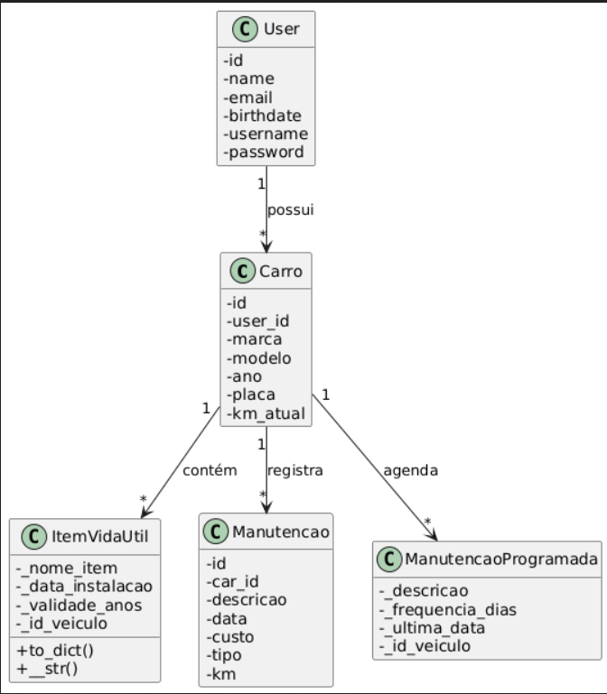

# Projeto Template: POO com Python + Bottle + JSON

Este é um projeto de template educacional voltado para o ensino de **Programação Orientada a Objetos (POO)** do Prof. Lucas Boaventura, Universidade de Brasília (UnB).

Utiliza o microframework **Bottle**. Ideal para uso em disciplinas introdutórias de Engenharia de Software ou Ciência da Computação.

## 💡 Objetivo

Fornecer uma base simples, extensível e didática para construção de aplicações web orientadas a objetos com aplicações WEB em Python, ideal para trabalhos finais ou exercícios práticos.

---

## 🗂 Estrutura de Pastas

```bash 
epf-RedLine/
├── app.py
├── auth_decorator.py
├── config.py
├── controllers
│   ├── auth_controller.py
│   ├── car_controller.py
│   ├── dashboard_controller.py
│   ├── manutencao_controller.py
│   ├── __pycache__
│   │   ├── auth_controller.cpython-311.pyc
│   │   ├── auth_controller.cpython-313.pyc
│   │   ├── base_controller.cpython-313.pyc
│   │   ├── car_controller.cpython-311.pyc
│   │   ├── car_controller.cpython-313.pyc
│   │   ├── dashboard_controller.cpython-313.pyc
│   │   ├── __init__.cpython-313.pyc
│   │   ├── manutencao_controller.cpython-311.pyc
│   │   ├── manutencao_controller.cpython-313.pyc
│   │   ├── user_controller.cpython-311.pyc
│   │   └── user_controller.cpython-313.pyc
│   └── user_controller.py
├── data
│   ├── carros.json
│   ├── manutencoes.json
│   └── users.json
├── data_manager.py
├── Makefile
├── models
│   ├── carro.py
│   ├── itemVidaUtil.py
│   ├── maintenance.py
│   ├── manutencaoProgramada.py
│   ├── manutencao.py
│   ├── __pycache__
│   │   ├── maintenance.cpython-313.pyc
│   │   ├── manutencao.cpython-313.pyc
│   │   ├── user.cpython-313.pyc
│   │   └── vehicle.cpython-313.pyc
│   ├── user.py
│   └── vehicle.py
├── __pycache__
│   ├── app.cpython-313.pyc
│   ├── auth_decorator.cpython-311.pyc
│   ├── auth_decorator.cpython-313.pyc
│   ├── config.cpython-313.pyc
│   ├── data_manager.cpython-311.pyc
│   └── data_manager.cpython-313.pyc
├── README.md
├── requirements.txt
├── services
│   ├── car_service.py
│   ├── manutencao_service.py
│   ├── __pycache__
│   │   ├── car_service.cpython-311.pyc
│   │   ├── car_service.cpython-313.pyc
│   │   ├── maintenance_service.cpython-313.pyc
│   │   ├── manutencao_service.cpython-311.pyc
│   │   ├── manutencao_service.cpython-313.pyc
│   │   ├── user_service.cpython-311.pyc
│   │   ├── user_service.cpython-313.pyc
│   │   └── vehicle_service.cpython-313.pyc
│   ├── user_service.py
│   └── vehicle_service.py
├── static
│   ├── css
│   │   ├── dashboard.css
│   │   ├── helper.css
│   │   └── style.css
│   ├── img
│   │   └── BottleLogo.png
│   └── js
│       ├── helper.js
│       └── main.js
├── test.py
├── view_helper.py
└── views
    ├── car_form.tpl
    ├── car_list.tpl
    ├── dashboard.tpl
    ├── helper-final.tpl
    ├── home_logged.tpl
    ├── home.tpl
    ├── layout.tpl
    ├── login.tpl
    ├── manutencao_form.tpl
    ├── manutencao_list.tpl
    ├── signup.tpl
    ├── user_form.tpl
    └── users.tpl
```
---

## 📁 Descrição das Pastas

### `controllers/`
Responsáveis pelas rotas e lógica de fluxo da aplicação:

- **auth_controller.py** — Login e cadastro de usuários.
- **car_controller.py** — CRUD de veículos.
- **dashboard_controller.py** — Página inicial do usuário logado.
- **manutencao_controller.py** — CRUD de manutenções realizadas.
- **user_controller.py** — Gerenciamento de usuários cadastrados.

---

### `models/`
Definem as entidades e estruturas de dados principais:

- **user.py** — Dados do usuário (login e perfil).
- **vehicle.py** — Dados de veículos.
- **maintenance.py** — Registro de manutenções realizadas.
- **manutencaoProgramada.py** — Modelo de manutenção programada.
- **itemVidaUtil.py** — Informações sobre vida útil de itens.
- **carro.py** — Estrutura auxiliar de veículos.
- **manutencao.py** — Estrutura auxiliar de manutenção.

---

### `services/`
Responsáveis pela persistência e manipulação de dados JSON:

- **user_service.py** — Operações com usuários (*create_account*, *authenticate*, etc.).
- **car_service.py** — Operações com veículos.
- **manutencao_service.py** — Operações com manutenções.
- **vehicle_service.py** — Regras e utilidades sobre veículos.

---

### `views/`
Templates HTML (Bottle Templating Language):

- **login.tpl**, **signup.tpl** — Telas de autenticação.
- **dashboard.tpl** — Página inicial.
- **car_list.tpl**, **car_form.tpl** — Listagem e cadastro de veículos.
- **manutencao_list.tpl**, **manutencao_form.tpl** — Listagem e cadastro de manutenções.
- **users.tpl**, **user_form.tpl** — Gerenciamento de usuários.
- **layout.tpl** — Layout base reutilizável.

---

### `static/`
Arquivos estáticos usados no front-end:

- **css/** — Estilos (ex.: *style.css*, *dashboard.css*).
- **js/** — Scripts JavaScript (*main.js*, *helper.js*).
- **img/** — Imagens da aplicação.

---

### `data/`
Arquivos JSON que simulam o banco de dados:

- **users.json** — Usuários cadastrados.
- **carros.json** — Veículos registrados.
- **manutencoes.json** — Histórico de manutenções.
- *(A pasta `sessions/` é criada automaticamente em runtime e pode ser ignorada pelo Git.)*

---

## ▶️ Como Executar

1. Crie o ambiente virtual na pasta fora do seu projeto:
```bash
python -m venv venv
source venv/bin/activate  # Linux/Mac
venv\\Scripts\\activate     # Windows
```

2. Entre dentro do seu projeto criado a partir do template e instale as dependências:
```bash
pip install -r requirements.txt
```

3. Rode a aplicação:
```bash
python app.py
```

4. Accese sua aplicação no navegador em: [http://localhost:8080](http://localhost:8080)

---

## ✍️ Personalização
Para adicionar novos modelos (ex: Atividades):

1. Crie a classe no diretório **models/**.

2. Crie o service correspondente para manipulação do JSON.

3. Crie o controller com as rotas.

4. Crie as views .tpl associadas.

---

## 🧠 Autor e Licença
Projeto desenvolvido como template didático para disciplinas de Programação Orientada a Objetos, baseado no [BMVC](https://github.com/hgmachine/bmvc_start_from_this).
Você pode reutilizar, modificar e compartilhar livremente.
# epf-RedLine
